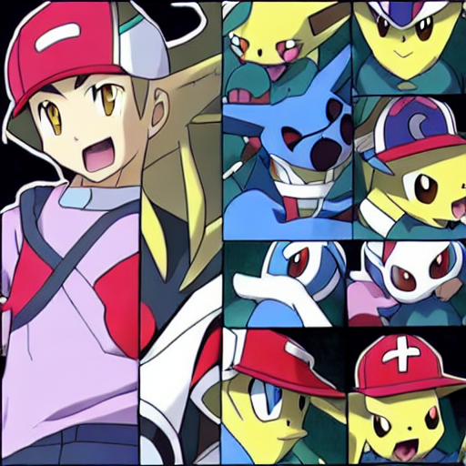

# StableDiffusion_Pokemon

Generate Pokémon images from text prompts using Stable Diffusion with an interactive Gradio interface.

## Overview

This project is a quick demo built in about 1 hour to showcase text-to-image generation with Stable Diffusion. It uses the pre-trained "runwayml/stable-diffusion-v1-5" model and adds a Gradio UI for real-time interaction. Originally, I aimed to fine-tune on the "diffusers/pokemon-gpt4-captions" dataset, but time constraints led to a polished base-model demo instead—fine-tuning is next on the list!

## Features

- Text-to-Image: Enter prompts like "A cool Pokémon in anime style" to generate unique images.
- Gradio Interface: Interactive web UI for easy use, shareable via a public link.
- Built Fast: From idea to GitHub in about 1 hour, using Colab and local tweaks.

## Tech Stack

- Stable Diffusion: "runwayml/stable-diffusion-v1-5" (Hugging Face Diffusers)
- Gradio: For the interactive frontend
- PyTorch: Backend for GPU-accelerated generation
- Python: Core scripting in Jupyter Notebook

## Setup & Usage

1. Clone the Repo:
   git clone https://github.com/anakintano/StableDiffusion_pokemon.git
   cd StableDiffusion_pokemon

2. **Install Dependencies**:
   ```bash
   pip install diffusers torch transformers accelerate gradio
   ```

3. **Run the Notebook**:
   - Open `StableDiffusion_Pokemon.ipynb` in Jupyter:
     ```bash
     jupyter notebook StableDiffusion_Pokemon.ipynb
     ```
   - Execute all cells to launch the Gradio interface.
   - Use the local URL (e.g., `http://127.0.0.1:7860`) or the public link (if `share=True`) to generate images.

4. **Try a Prompt**:
   - Example: "A cool Pokémon in anime style"

## Output

Here’s a sample generated image:


## Project Notes

- **What Worked**: Base model generation and Gradio UI were seamless.
- **What Didn’t**: Fine-tuning hit dataset access issues and time limits—future iterations will tackle this.
- **Next Steps**: Fine-tune on a Pokémon dataset, add multi-image generation, and optimize performance.

## Contributing

Feel free to fork, tweak, or suggest improvements! Open an issue or PR—I’m here to collaborate.

## License

MIT License—see [LICENSE](LICENSE) if added, or assume open-source for now.

---

Built by [anakintano](https://github.com/anakintano) | March 2025
```
